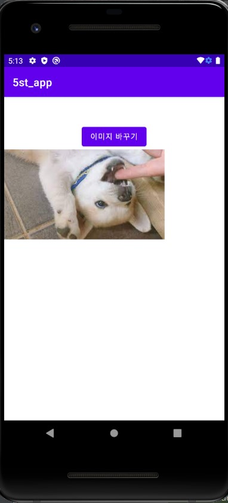

# 20173022_ssy_androidApp
## 1주차
## 2주차
  </img>
## 3주차
  </img>
  </img>
## 4주차
1. 기획하고자 하는 앱: 커플, 우정 다이어리 어플
2. 선정이유 및 세부 기능: 친구나 연인과 여러 앱을 이용하면서 먼 거리에서도 같이 놀 수 있는 통합 된 어플을 본적이 없습니다. 코로나 바이러스로 인해 만남을 갖기가 쉽지 않기때문에 이러한 어플이 있으면 좋겠다는 생각이 들었습니다. AR기능도 넣어 특정 장소에 놀러간 기분이 들게끔 하는 기능도 추가하고싶습니다.
## 5주차
  </img>
  </img>

